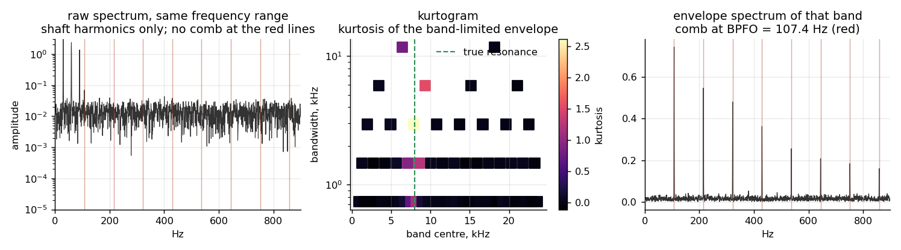
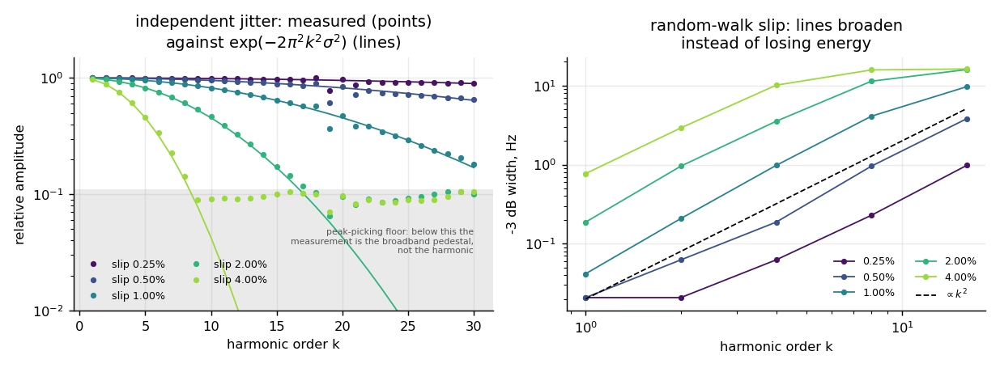
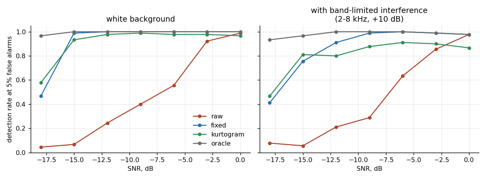
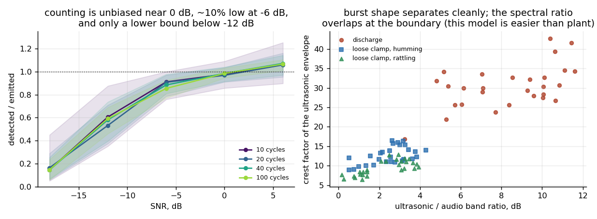
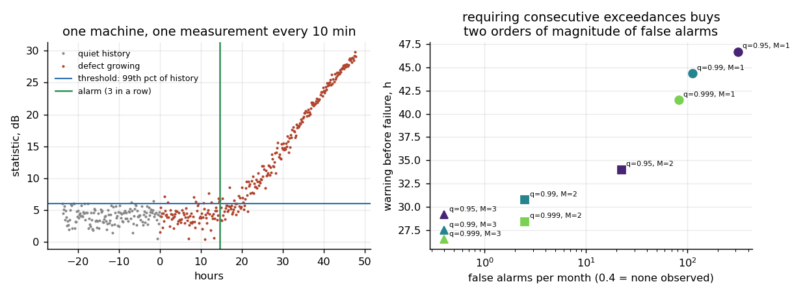
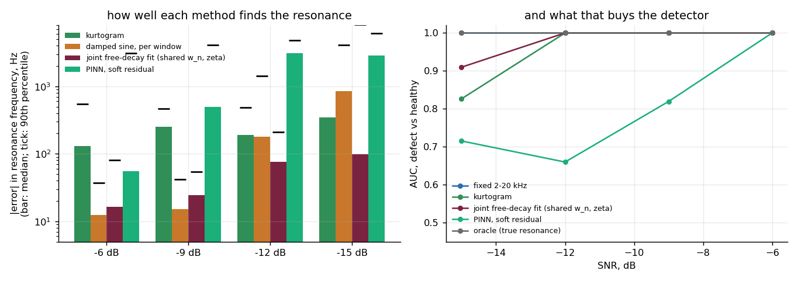

# Vibroacoustic diagnostics of industrial machinery

What a condition-monitoring module can and cannot decide from sound and
vibration — worked out quantitatively, for rotating machinery and for
high-voltage plant.

A predictive-diagnostics module clamped to a pump, a compressor or a
transformer tank has to answer three questions before it is worth its
installation cost:

1. **Which part of the spectrum should it listen to?** The defect is never
   where the energy is.
2. **How much of the diagnostic signature survives the machine's own
   irregularity?** Bearings slip; discharges ignite at random.
3. **When should it raise an alarm?** A system that cries wolf is switched
   off, and a system that warns an hour ahead has warned nobody.

This repository documents the measurements behind those answers.

---

## Read this first: what the numbers are measured on

Every result here comes from **physical signal models**, not from plant
recordings. Each model is written from the mechanism up — impulse trains from
a spalled raceway convolved with a structural resonance, discharge bursts
phase-locked to the mains and filtered by the propagation path — and each is
checked against an independent prediction before it is used (see
*Verification*).

That makes these results statements about **method and detection limits**,
not about any particular machine. Where the model is easier than plant, this
page says so rather than quoting the flattering number. Field validation is
the separate step, and nothing here substitutes for it.

---

## Design rules that came out of it

| # | Rule | Where it comes from |
|---|------|---------------------|
| 1 | Never look for a defect frequency in the raw spectrum. Demodulate. | §1 — detection rate 0.24 vs 1.00 at −12 dB |
| 2 | Sum no more than `k_max ≈ 0.225 / slip` harmonics. At 1% slip that is 22; at 4% it is 6. | §2, verified to 3% over a 16× range of slip |
| 3 | Widen the harmonic window only if the slip is a random walk. For independent jitter a wider window collects noise, not signal. | §2 — linewidth grows as k², or not at all |
| 4 | Do not pay for per-record adaptive band selection. Pay instead for measuring each sensor's structural resonance once, at commissioning. | §3 — the kurtogram never beats a fixed wide band by more than the noise of 90 records, and with an interferer it is behind at every SNR down to −12 dB (p < 0.05); knowing the resonance beats both by 0.5 in detection rate at −18 dB (+45 of 90 records, p ≈ 10⁻¹³) |
| 5 | An ultrasonic-band energy ratio does not detect partial discharge against sensor noise. It is the phase-locked event structure that does. | §4 — ratio AUC 0.36–0.55 |
| 6 | Require M consecutive exceedances rather than a higher threshold. Three-in-a-row cut false alarms from 315/month to none observed while keeping 29 h of the 48 h warning. | §5 |
| 7 | When the physics is a two-parameter equation, put it in the model class, not in a loss term. A joint free-decay fit with shared (ωₙ, ζ) recovers the resonance to 98 Hz at −15 dB; a physics-informed network on the same windows is off by 2.8 kHz. | §6 — the PINN is the honest negative |

---

## 1. The defect is not where the energy is



A localised raceway defect produces a train of short impacts. Each impact
rings the structure between the defect and the sensor, so the energy lands at
the structural resonance — several kilohertz — and the defect frequency
appears only as the *repetition rate* of that ringing, i.e. as a modulation.

The left panel is the plain spectrum over the frequency range where the
defect frequency lives. The running speed and its harmonics are there; the
defect comb (red lines) is not. The right panel is the spectrum of the
amplitude envelope of the band around the resonance, from the very same
record: the comb at the ball-pass frequency of the outer race is unmistakable,
out to the eighth harmonic.

Over a population of machines with unknown resonances, at 5% false alarms:

| SNR | raw spectrum | envelope, fixed band |
|-----|--------------|----------------------|
| −6 dB | 0.56 | 1.00 |
| −12 dB | 0.24 | 1.00 |
| −15 dB | 0.07 | 0.99 |

The middle panel is the kurtogram — the kurtosis of the band-limited
envelope over a grid of centre frequencies and bandwidths. Impulsive content
raises it, so the brightest cell should be the band the impacts live in. It
finds the true 8 kHz resonance here. Section 3 asks whether that is worth
anything.

**One constraint worth stating explicitly:** a demodulation band of width *B*
produces an envelope whose spectrum only reaches about *B*. Asking for six
harmonics of a 107 Hz defect frequency therefore requires at least ~640 Hz of
bandwidth. Without that constraint the kurtogram of a *healthy* record drifts
into narrow low-frequency bands whose envelope spectrum rolls off inside the
search range, and any statistic measured against a global noise floor then
reports a defect that is not there. This is the kind of bug that ships.

---

## 2. How far up the harmonic series can you go?



Rolling elements do not roll perfectly. The impulse train is not exactly
periodic, and the high harmonics lose coherence first. How fast depends on
what *kind* of irregularity it is, and the two kinds behave differently in
kind, not merely in degree.

**Independent jitter.** If each impact is displaced independently by
`e ~ N(0, σ_t²)`, the expected amplitude at frequency *f* is multiplied by the
characteristic function of the jitter, `exp(−2π²f²σ_t²)`. Writing the slip as
a fraction of a period, `σ = σ_t·f_d`, the k-th harmonic is attenuated by

```
a(k) = exp(−2π² k² σ²)      →      k_max = 0.2251 / σ
```

Measured against that prediction (left panel, points vs lines), fitting the
decay back to the slip that produced it:

| true slip | recovered slip | k_max predicted | k_max measured |
|-----------|----------------|-----------------|----------------|
| 0.25% | 0.27% | 90 | 84 |
| 0.5% | 0.51% | 45 | 44 |
| 1% | 0.99% | 22.5 | 22.7 |
| 2% | 1.98% | 11.3 | 11.4 |
| 4% | 3.90% | 5.6 | 5.8 |

The energy lost from the lines does not disappear — it reappears as a
broadband pedestal, which is the grey band in the figure. Below it the
"harmonic amplitude" being measured is the pedestal, not the harmonic.

*A control that mattered:* the resonance's own impulse response has a finite
decay time (~1 ms here), and that alone rolls the harmonic series off with a
corner near 160 Hz — below the second harmonic. Fitting the jitter law
without dividing that out returns σ ≈ 0.017 for every slip from 0.25% to 4%:
it measures the impulse shape and calls it slip.

**Random-walk slip.** If instead the *interval* fluctuates, phase error
accumulates and the lines broaden rather than fade. Measured exponent of
linewidth against harmonic order: **1.98, 2.01, 2.00** for slips of 0.25%,
0.5% and 1% — the predicted k². (At 2% and 4% the fit falls to 1.64 and 1.12,
because neighbouring harmonics have merged and there is no separate line left
to measure.)

The practical consequence is rule 3 above: the two cases call for opposite
window policies, so a module that widens its harmonic windows "to be safe"
is collecting noise in half of all installations.

---

## 3. Choosing the band: the result that was not expected



Four strategies over a fleet whose resonances are drawn between 4 and 14 kHz
and are *not* known to the detector: no demodulation; one fixed 2–20 kHz band
for everything; the kurtogram, choosing per record; and an oracle centred on
that record's true resonance.

Adaptive band selection **does not beat the fixed wide band**. On a white
background the fixed band is at or above the kurtogram down to −15 dB; at
−18 dB the kurtogram is ahead, 52 against 42 of 90 records, which is inside
the noise (two-proportion z = 1.5, p = 0.14). An earlier version of this
paragraph said "at or above everywhere", which the table below shows is not
what the file says. With a strong band-limited interferer over the lower half
of the band — cavitation, gear mesh, a neighbouring machine — the kurtogram
pulls ahead only in the last two SNR points, by 5 records of 90 (p ≈ 0.4),
and it is **significantly behind the fixed band at every SNR from 0 to
−12 dB** (8–10 records of 90 behind, p = 0.003–0.03), because the interferer
is impulsive enough to attract the kurtosis maximum.

Every rate on this page in §3 is pooled over three defect types (outer race,
inner race, rolling element), 30 records each, so 90 records per cell. With
the interval attached (`results/band_selection_intervals.json`, Wilson 95 %):

| SNR | background | fixed 2–20 kHz | kurtogram | oracle | kurtogram − fixed | oracle − fixed |
|---|---|---|---|---|---|---|
| −12 dB | white | 90/90 | 88/90 | 90/90 | −2, p = 0.16 | 0 |
| −15 dB | white | 89/90 | 84/90 | 90/90 | −5, p = 0.05 | +1 |
| −18 dB | white | 42/90 [0.37, 0.57] | 52/90 [0.47, 0.67] | 87/90 [0.91, 0.99] | +10, p = 0.14 | +45, p ≈ 10⁻¹³ |
| −12 dB | interferer | 82/90 | 72/90 | 90/90 | −10, p = 0.03 | +8, p = 0.004 |
| −15 dB | interferer | 68/90 [0.66, 0.83] | 73/90 [0.72, 0.88] | 87/90 | +5, p = 0.37 | +19, p = 4 × 10⁻⁵ |
| −18 dB | interferer | 37/90 [0.32, 0.51] | 42/90 [0.37, 0.57] | 84/90 [0.86, 0.97] | +5, p = 0.45 | +47, p ≈ 10⁻¹³ |

The per-defect split (in the same file) shows no defect type carrying the
gap: at −18 dB on white the fixed band detects 12, 17 and 13 of 30 for the
outer race, inner race and rolling element, the kurtogram 15, 18 and 19.

The oracle, meanwhile, is far ahead of both: at −18 dB it detects 0.97 where
the fixed band manages 0.47 and the kurtogram 0.58. The kurtogram's estimate
of the resonance has a median error of 340 Hz but a 90th percentile of
2.6 kHz, rising to 6.6 kHz once there is interference — it is right most of
the time and badly wrong often enough to matter.

So the money is not in cleverer per-record band selection. It is in **knowing
the resonance**, which is a fixed property of the sensor and its mounting and
can be measured once at commissioning with an impact test, then stored per
sensor. That is a configuration step, not an algorithm.

---

## 4. Partial discharge, and the loose bolt that looks exactly like it



Discharges are driven by the instantaneous voltage, so they cluster near the
peaks — twice per cycle, ~100 Hz on a 50 Hz supply. A loose clamp on the same
tank does the same thing, at the same rate, for entirely mechanical reasons.
A detector keyed on "activity at twice the mains frequency" answers
*discharge* to both, and every such answer dispatches a crew to healthy plant.

**Counting comes before classifying.** The simulator knows how many bursts it
emitted, so the event detector can be calibrated directly. Adaptive threshold
at median + 8·MAD, 40 mains cycles:

| SNR | detected / emitted |
|-----|--------------------|
| +6 dB | 1.07 |
| 0 dB | 0.98 |
| −6 dB | 0.88 |
| −12 dB | 0.58 |
| −18 dB | 0.14 |

Below about −12 dB the count is a **lower bound, not a measurement**, and
every statistic built on top of it — rate, phase concentration, Fano factor —
inherits that. A module in this regime should report "no decision", not a
confident number. Longer windows do not fix it: 10 cycles and 100 cycles give
the same recovery ratio, because the problem is per-event detectability, not
sample size.

**The single-number rule of thumb fails.** Ultrasonic-band energy over
audio-band energy — what a threshold on a broadband ultrasonic meter amounts
to — separates discharge from sensor noise at AUC 0.36–0.55, i.e. not at all,
and at the low end *backwards*: broadband sensor noise has a flatter spectrum
than a discharge that has crossed oil and steel, so the ratio can be higher
for a healthy sensor than for a live fault. What separates them is the
phase-locked event structure, which no energy ratio can see.

**Honest limit of this section.** Against the mechanical confuser, the six
features separate discharge at AUC ≈ 1.0 at every SNR tested — but so does
the crest factor on its own, and nearly so does the energy ratio. That says
the model's two classes are further apart than plant classes are, not that the
problem is solved. The transferable results here are the counting calibration
and the negative result about energy ratios; the AUC is not.

---

## 5. From a statistic to an alarm somebody will act on



One measurement every 10 minutes is 4 320 decisions a month. A threshold with
a 1% per-record false-alarm rate therefore fires about 43 times a month, and
the system gets switched off. The experiment runs a fleet through 24 h of
quiet history and then 48 h in which the defect grows, sets the threshold from
the first half of each machine's *own* history, and measures false alarms on
the held-out half:

| threshold | consecutive | false alarms / month | median warning before failure |
|-----------|-------------|----------------------|-------------------------------|
| 95th pct | 1 | 315 | 46.7 h |
| 99th pct | 1 | 113 | 44.3 h |
| 99.9th pct | 1 | 83 | 41.5 h |
| 95th pct | 2 | 22.5 | 34.0 h |
| 99th pct | 2 | 2.5 | 30.8 h |
| 99th pct | 3 | none observed | 27.5 h |

Two things are visible. First, **raising the threshold barely helps**: going
from the 95th to the 99.9th percentile only takes 315 false alarms a month
down to 83, because 72 baseline samples cannot resolve a 1-in-1000 tail — the
quantile is beyond the data. Second, **requiring consecutive exceedances
works**, and cheaply: three in a row removed every false alarm in 1 728
held-out opportunities while still leaving 27 of the 48 hours of warning.

"None observed" is not zero. By the rule of three, 0 events in 1 728 trials
bounds the rate at under 7.5 false alarms per month with 95% confidence. To
claim less than one a month, the baseline has to be roughly ten times longer.

The alarm fires at a median defect level of −18 dB SNR, which is where §3 put
the detection floor for a fixed band. The chain is consistent end to end.

---

## 6. Identifying the resonance from the record itself



§3 ended with a configuration step: measure each sensor's structural
resonance once, at commissioning, with an impact test. This section asks
whether the record can supply the resonance on its own — because the
resonance *is* in the signal. Every impact rings the housing, and the ringing
between impacts obeys the free-decay equation of a damped oscillator,

    x'' + 2 ζ ωₙ x' + ωₙ² x = 0 .

Sixteen 2.5 ms windows are cut after the strongest impacts of each record
(high-passed above 1 kHz, so that the shaft harmonics do not sit inside a
window as an offset and a slope), and three estimators are asked for
(ωₙ, ζ):

- **damped sine, per window** — nonlinear least squares of
  A e^(−ζωₙt) sin(ω_d t + φ) on each window, median over windows: the
  classical estimate.
- **joint free-decay fit** — one (ωₙ, ζ) for all sixteen windows, with the
  amplitude and phase of each window solved linearly (variable projection):
  the exact-physics estimator with shared parameters.
- **PINN** — a network x(t) for all windows, with a window embedding and
  Fourier features, whose loss is the data misfit plus the residual of the
  equation of motion at collocation points between the samples, (ωₙ, ζ)
  trainable and shared across windows.

The band for demodulation is then centred on the identified resonance and
run through the §3 detection benchmark (12 machines per SNR, resonances
drawn between 4 and 14 kHz, damping 0.01–0.05) against the fixed band, the
kurtogram and the oracle.

| SNR | kurtogram | damped sine | joint fit | PINN |
|---|---|---|---|---|
| −6 dB | 130 Hz | 12 Hz | 17 Hz | 56 Hz |
| −9 dB | 253 Hz | 15 Hz | 25 Hz | 492 Hz |
| −12 dB | 189 Hz | 178 Hz | **77 Hz** | 3 092 Hz |
| −15 dB | 343 Hz | 847 Hz | **98 Hz** | 2 836 Hz |

*Median absolute error of the resonance frequency; the 90th percentiles are
the ticks in the figure.*

**Sharing the parameters is what matters; the network is not.** Down to
−9 dB the per-window fit is excellent and the joint fit slightly worse than
it (the joint fit is pulled by the worst windows; the median over windows is
not). Below that the per-window fit collapses — 847 Hz median and a damping
error of 550 % at −15 dB — while the joint fit, which has sixteen windows'
worth of evidence for a single pair of numbers, holds at 98 Hz and stays
within a factor of two on the damping. In the detector that is the
difference between AUC 0.90 and 0.91 at −15 dB, both close to the
oracle's 1.00; at these SNRs the fixed 2–20 kHz band also detects
perfectly, and the value of a resonance estimate is the one §3 measured at
−18 dB.

**The PINN is an honest negative.** It is the worst of the three
estimators at every SNR (median errors of 0.5–3 kHz below −9 dB, AUC
0.66–0.82), and the reasons are recorded because they are general:

1. *A trainable normalisation in the physics loss is a bias.* The first
   version divided the residual by ωₙ⁴ to make the loss dimensionless, so
   "small residual" was cheapest at large ωₙ and every estimate drifted to
   12 kHz. The normalisation must be a fixed constant.
2. *Fourier features above the Nyquist frequency are a loophole.* With
   features reaching 25 kHz on 48 kHz samples, the network could oscillate
   *between* the samples and satisfy the equation of motion at the samples
   for any ωₙ. Features must stop below Nyquist (16 kHz here), and the
   residual must be evaluated at collocation points between the samples.
3. *With the loopholes closed, the estimator is still poor.* The network
   absorbs noise into x(t), and the residual's dependence on ωₙ is then
   weak; the optimiser often leaves ωₙ near its 8 kHz initialisation
   (machines at 11–13 kHz come back at 7.5–8 kHz). The joint fit has no
   such freedom: it can *only* represent damped sinusoids, and that
   restriction is exactly the prior knowledge that makes the estimate
   robust at low SNR.

The rule this gives the framework: when the physics is a two-parameter
equation and the data are short windows of it, put the physics in the
*model class* (a damped sinusoid with shared parameters), not in a loss
term on a free function. The PINN belongs where the field is not known in
closed form; here it is.

**What this changes in rule 4.** The commissioning impact test remains
the right thing to do — it costs a minute and needs no algorithm. But where
it was not done, a joint free-decay fit over the strongest impacts of a
faulty record recovers the resonance to within 100 Hz at −15 dB, which is
enough to place the demodulation band; the record can bootstrap its own
oracle.

---

## Verification

Physics and estimator checks run as a test suite (12 checks, all passing):

- kinematic frequencies reproduce the tabulated multipliers for a documented
  bearing geometry to 2 × 10⁻⁵ — including resolving an apparent factor-of-two
  discrepancy in the published ball-spin figure, which lists the *impact* rate
  (a spall strikes both races), not the ball rotation rate
- the identities `BPFO + BPFI = n·f_r` and `BPFO = n·FTF` hold exactly
- the spectral-kurtosis estimator returns zero on circular complex Gaussian
  noise
- the jitter law recovers the slip that generated the signal, to 15%
- the harmonic statistic on healthy records does not drift with background
  level (< 1.5 dB across a 20 dB range) — otherwise the threshold would have
  to be re-derived at every operating point
- discharge records are more impulsive, and their per-half-cycle counts more
  variable (Fano > 1 vs < 1), than mechanical ones
- the impact windows contain the resonance and no offset: after the
  high-pass, the strongest line in a window sits at the resonance
- the joint free-decay fit recovers (ωₙ, ζ) from sixteen noisy windows to
  1 % and 20 %
- the network's Fourier features reach every resonance the benchmark draws
  and stop below the Nyquist frequency
- **the §6 result is pinned**: at every SNR the joint fit is at least as
  good as the kurtogram at the median, and the network is not better than
  the estimator without a network

---

## What this does not show

- **No plant data.** Detection rates here are properties of the models, not
  of any installed system. Only field data can confirm the SNR at which a
  particular sensor and mounting actually operate.
- **One fault at a time.** Real machines present bearing wear, misalignment
  and looseness simultaneously; the interaction is not modelled.
- **Stationary speed.** Variable-speed drives require order tracking, which is
  a separate problem and is not addressed.
- **Single resonance.** A real transmission path has many, and the impulse
  response is not a single decaying sinusoid.
- **The discharge classes are too far apart**, as §4 says of itself.

---

## Source code

The physics core is public in this repository:

- `src/kinematics.py` — bearing defect frequencies from geometry
- `src/bearing_sim.py` — the impulse-train / resonance signal model
- `src/envelope.py` — demodulation, envelope spectrum, harmonic statistic,
  spectral kurtosis and the kurtogram
- `src/exp2_detection.py` — the detection benchmark of §3 (fleet of
  machines, band strategies, pooled scoring)
- `src/exp5_resonance_pinn.py` — the three resonance estimators of §6 and
  the benchmark that compares them
- `src/band_selection_intervals.py` — reads the §3 result files and attaches
  counts, Wilson intervals and two-proportion tests to every rate
- `tests/test_all.py` — the twelve checks above (the two discharge checks
  need the private model and skip themselves without it)
- `tests/test_readme_numbers.py` — pins every number quoted in §1, §3, §5
  and §6 to the files in `results/`, so a regenerated result that no longer
  matches the text fails

The partial-discharge model and features (§4), the slip and alarm-policy
experiments (§2, §5) and the figure scripts are held in a private
repository.
`results/` holds every number on this page as JSON.

```
pip install -r requirements.txt
python tests/test_all.py
python -m pytest tests/test_readme_numbers.py
python src/exp5_resonance_pinn.py     # ~2 h on a laptop CPU
```

---

## Scope

The three regimes covered — rotating machinery, partial discharge in
high-voltage plant, and threshold policy for continuous monitoring — are the
ones where the acoustic signature has a mechanism you can write down and
therefore a detection limit you can compute. Boiler and heat-exchanger
monitoring is a fourth such area, where the diagnostic bands are set by phase
transition and combustion rather than by rotation; it is not covered here.

## Licence

Documentation, figures and result files: CC BY 4.0. Source code in `src/`
and `tests/`: MIT.
